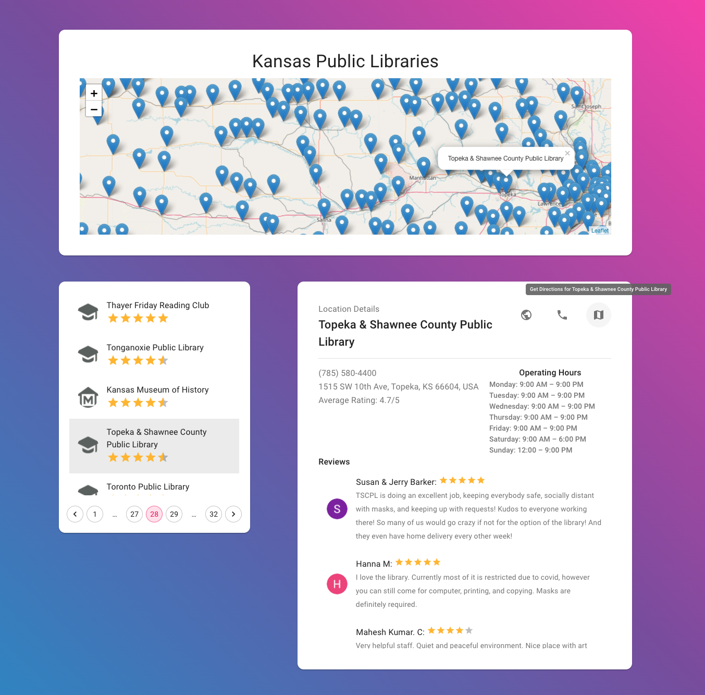

# Kansas Public Libraries
A quick example showing the use of React-Query/Axios to retrieve data from an "API" created by data-scraping and geo-reverse lookups.

## 1. Install Project:
In the project directory, run:

### `yarn install`

## 2. (optional) Scrape & Create the JSON file:
In the project directory, run:
### `node generateData.js YOUR_GOOGLE_PLACES_API_KEY`
##### *Note - this file has already been generated & located in the 'public' folder.*
##### *Note - takes approximately 12 minutes to generate at default `sleepRate`.*

## 3. Run Project:
In the project directory, run:

### `yarn start`

The app will open in the development mode.\
Open [http://localhost:3000](http://localhost:3000) to view it in the browser.

## 4. To-Dos:
- Get `LocationList` to be able to trigger `Marker` inside of `LocationsMap` via onClick.

### Example:
